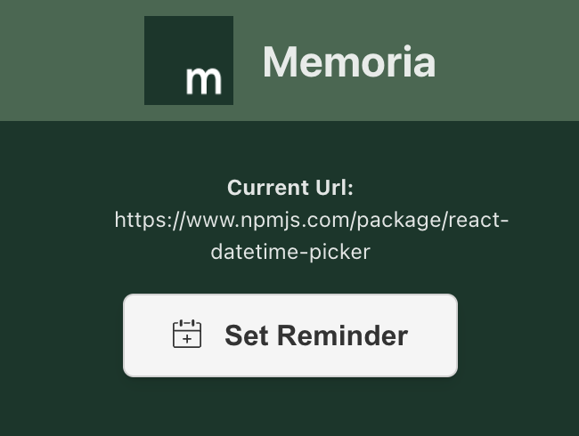

<!-- 

<h1 style="margin-left: 1em;">Memoria</h1>

 -->

A chrome extension to set web page reminders -- an alternative to creating bookmarks that eventually get forgotten..

## Why?

I regularly bookmark stuff and I hate that I never remember to get back to them. I have tried bookmark apps but all they do is organize. I have no problem with organization, I just want to be reminded.

## The plan

Use an extension to set bookmark reminders. Ideally, this would be a Chrome notification or a fancy email notification that can be "snoozed" to a later time.

However, I figured I could just put them in my calendar for a start before I over-architect the notifications service.

## Getting Started

This project uses [WXT](https://wxt.dev/), a Next-gen Web Extension Framework.

`pnpm install`

`pnpm run dev` to start the development server

`pnpm run build` to create an optimized build, a deployable extension.

### Custom Install

After running `pnpm run build`, a`dist/` directory is created with a `chrome-mv3/` directory that contains the deployable assets.

- Open up Chrome [You can build for Firefox too]
- Go to [extensions](chrome://extensions/)
- Turn on Developer mode
- Select `Load unpacked` and upload the `chrome-mv3/` directory.

Viola! Your extension is ready.

### To Do's

More like -- I am not sure when I'll do this but I hope I get the mindspace for it. Or at least anyone reading is willing to open a PR.

- [ ] Add a custom DateTime picker for the calendar dates and time. (Priority)

- [ ] Validate usage -- if it proves useful, prepare the notifications service. (Everything else is dependent on this)
